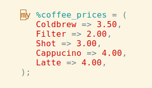

Hash-Tidy
=========
Fight entropy and disorder! Tidy your Perl/Raku hashes in vim.

It can sort keys by length:



It can align fat arrows:


Or do both:


Installation
============
This assumes you have Vim's builtin [filetype plugin option](http://vimdoc.sourceforge.net/htmldoc/filetype.html#:filetype-plugin-on)
enabled. (e.g., something like `filetype plugin on` in your `.vimrc`).

You can install this the same way you install any other Vim plugin: your
choice of raw unpacking, Pathogen, Vim-8 native, vim-plug, vundle, and
many other options.  Some of the ways are described in
[this gist](https://gist.github.com/manasthakur/ab4cf8d32a28ea38271ac0d07373bb53).
A walkthrough of Vim-8 native package installation is given in
[this blog post](https://shapeshed.com/vim-packages/).

Quick-and-dirty installation
----------------------------

In case you don't want to read the above links :) , you can:

1. Clone this repository into a location of your choice, e.g., `~/src/Hash-Tidy`.

2. Add this line to your `~/.vim/vimrc` file:

       set runtimepath+=~/src/Hash-Tidy

   (or whatever path you used).

3. Restart Vim.

Mapping Shortcuts
-----------------

After installing Hash-Tidy by whatever choice you prefer, you can
map shortcuts to run the routines. As this plugin works on Perl/Raku hashes,
you might put this code in `~/.vim/ftplugin/perl.vim` and
`~/.vim/ftplugin/perl6.vim` (for Raku):

```
vnoremap <buffer> <localleader>a :HashTidyAlignRange<cr>
vnoremap <buffer> <localleader>s :HashTidySortRange<cr>
vnoremap <buffer> <localleader>sa :HashTidySortAlignRange<cr>
```

In visual mode these map the shortcuts `leader` + s to sort, `leader` + a
to align and `leader` + sa to sort and align.  (The default `leader` is a
backslash.)

License
=======
Copyright 2020 David Farrell and contributors

Permission is hereby granted, free of charge, to any person obtaining a copy of
this software and associated documentation files (the "Software"), to deal in
the Software without restriction, including without limitation the rights to
use, copy, modify, merge, publish, distribute, sublicense, and/or sell copies
of the Software, and to permit persons to whom the Software is furnished to do
so, subject to the following conditions:

The above copyright notice and this permission notice shall be included in all
copies or substantial portions of the Software.

THE SOFTWARE IS PROVIDED "AS IS", WITHOUT WARRANTY OF ANY KIND, EXPRESS OR
IMPLIED, INCLUDING BUT NOT LIMITED TO THE WARRANTIES OF MERCHANTABILITY,
FITNESS FOR A PARTICULAR PURPOSE AND NONINFRINGEMENT. IN NO EVENT SHALL THE
AUTHORS OR COPYRIGHT HOLDERS BE LIABLE FOR ANY CLAIM, DAMAGES OR OTHER
LIABILITY, WHETHER IN AN ACTION OF CONTRACT, TORT OR OTHERWISE, ARISING FROM,
OUT OF OR IN CONNECTION WITH THE SOFTWARE OR THE USE OR OTHER DEALINGS IN THE
SOFTWARE.
